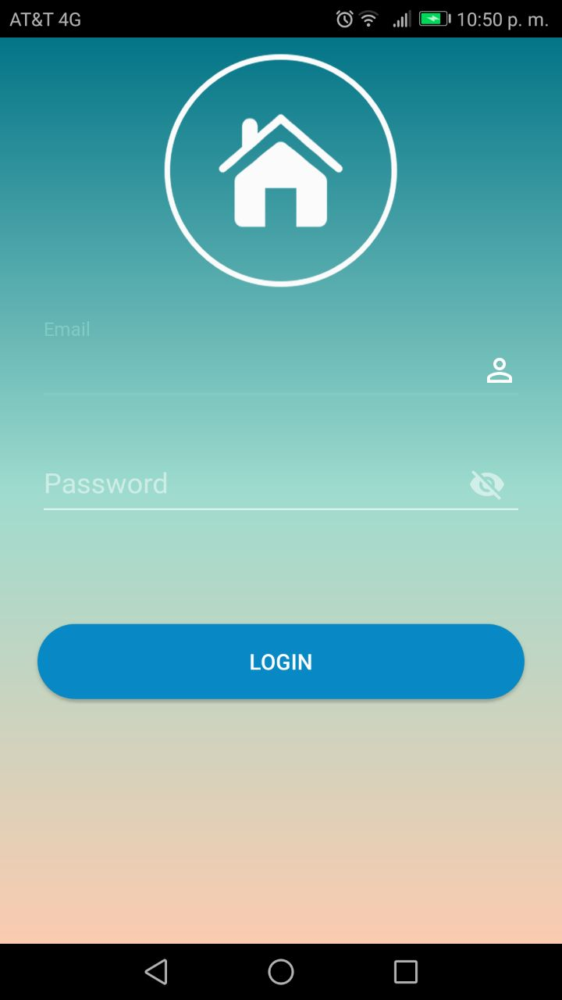
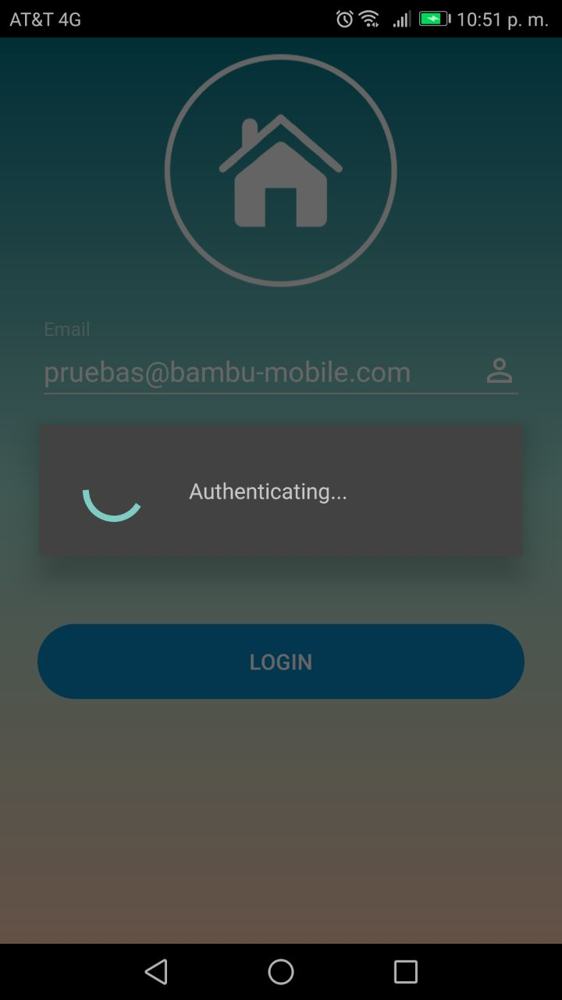
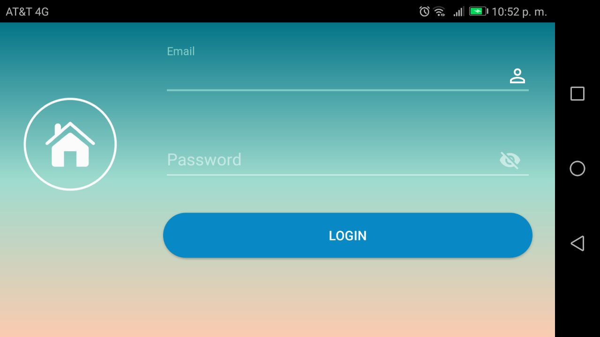

# App Login
> Ejercio de un login en aplicación android usando Firebase.

- La aplicación autentica las credenciales de ingreso usando Firebase.
 

- Mantiene la sesión activa hasta el log out.


- Cuenta con soporte de pantallas



## Dependencias
1. Primero se generaron las credenciales correspondientes y se descargo el archivo **google-services.json** el cual se agrega en project --> app 

2. Se usaron las dependencias de Firebase

* En el gradle projet añadimos el classpath

```
dependencies {
        classpath 'com.google.gms:google-services:3.2.0'
 }

```

* En el gradle app agregamos la dependencia y al final aplicamos el puggin

```
dependencies {
	...
 	implementation  'com.google.firebase:firebase-auth:11.2.0'
 	...
 }
apply plugin: 'com.google.gms.google-services'
```

## Contacto

Coral Rodríguez – [@coral](https://www.linkedin.com/in/dulcoral/) – dulcoral20@gmail.com

[git](https://github.com/dulcoral)

